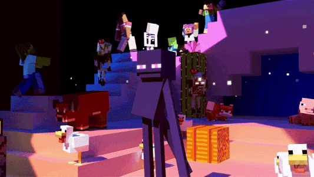

<!-- Banner -->

  

<h1 align="center"> Yoo Arish Singh Here !</h1>
<h3 align="center">Tech Explorer | AI & Web3 Developer | Creative Coder</h3>
<h4 align="center">
  🌱 <i>“I’d rather be a sprout — constantly growing, reaching for more — than a tree stuck in one place, just waiting for time to pass.”</i> 🌱
</h4>

   &nbsp;
  

---

 

<h2 align="">  About Me </h2>

<h4>🚀 Hey, I'm Arish Singh, a Java developer who loves turning ideas into real-world solutions.
I'm super passionate about building full-stack apps using the MERN stack.
Currently exploring Blockchain and AI to build smarter, future-ready projects.
I enjoy designing clean UIs and writing solid backend logic that just works.
Tech for me isn’t just about code — it’s about creating impact for society.
Always experimenting, learning new skills, and improving my system design & DevOps game.
I’m especially drawn to projects that solve real problems and help people.
Let’s just say — I code with purpose, and I’m only getting started. </h4>

 

   &nbsp;
   &nbsp;
   &nbsp;
  &nbsp;
  

 
 

<!-- 💻 SKILLS HEADER -->
<h2 align="">🛠️ Skills & Technologies</h2>
 
 

<!-- 🌌 SKILLS GRID WITH EMOJI RATINGS -->

<!-- Languages -->

<!-- Frameworks & Libraries -->

<!-- Tools & Databases -->

 
 

<!-- Contribution Days Count -->
## 📊 GitHub Status

  
  
   

<!-- 🗓️ Contribution Day Count -->

  

<!-- 🔥 GitHub Streak -->

  

<!-- 📈 GitHub Stats Card -->

  

<!-- 💻 Most Used Languages -->

  

## 🏆 GitHub Trophies 

<h5>Still learning the ropes, but I’ll be the one to set the bar</h5>

  

---

 

