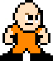
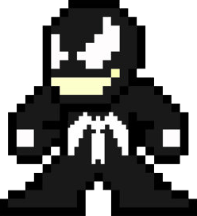
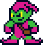
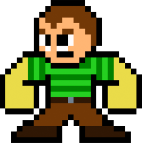
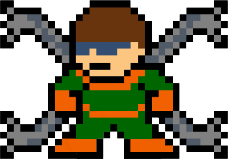
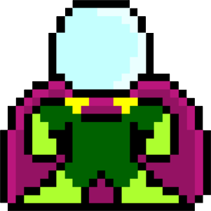

<h4 align=>  Arish Singh     
</b>

</h4>

 

  

     I would rather love to be a sprout, constantly growing and evolving, 
    than a tree standing still and waiting for time to pass.
  

<!-- GitHub Profile Views Counter -->

  
  

  

  

</ul>
  
----

<!-- Made with [OSS Insight](https://ossinsight.io/) -->

<h6 align="center">
 Fueled by caffeine and unnecessary side projects that i shift soon.
</h6>

