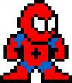
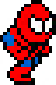
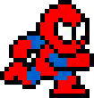
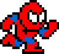
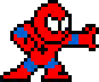
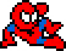

<h2 align=>  Arish Singh     
</b>

</h2>

 

  

     I would rather love to be a sprout, constantly growing and evolving, 
    than a tree standing still and waiting for time to pass.
  

<!-- GitHub Profile Views Counter -->

  
  

   

