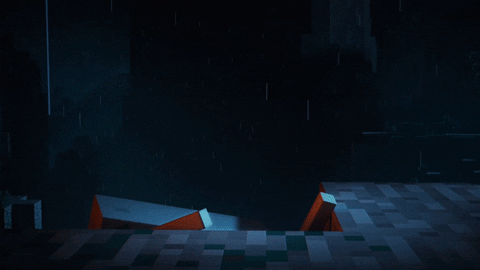

  

<!-- Banner -->
<!--  -->

<h2 align="center" > Yooo Arish Singh </b>

</h2>

<h4 align="center">
</h4>
 

  

     "I would rather love to be a sprout, constantly growing and evolving, 
    than a tree standing still and waiting for time to pass." 
  

<!-- GitHub Profile Views Counter -->

  
  

---

   
 

  
  
  
  
  

---

### 📦 Skills

  

---
### 
<ul align="left">
  <li><a href="https://dev.to/arishsingh99/amazon-q-developer-cli-2p3h"> how i build a Game with Amazon Q Developer CLI</a></li>
  <li><a href="https://dev.to/arishsingh99/aws-security-101-2g1a">  how i build a AWS Security 101</a></li>
</ul>

---

-------------------------------------------------------------------

  

-----------

